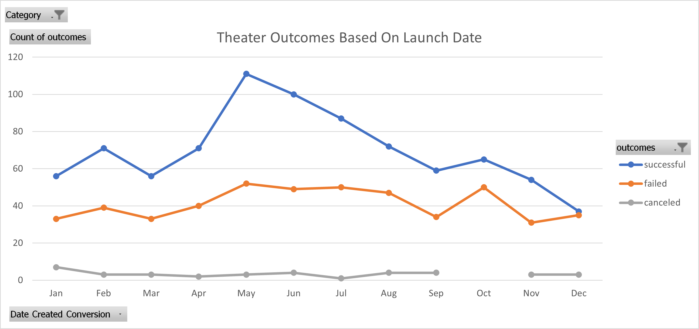
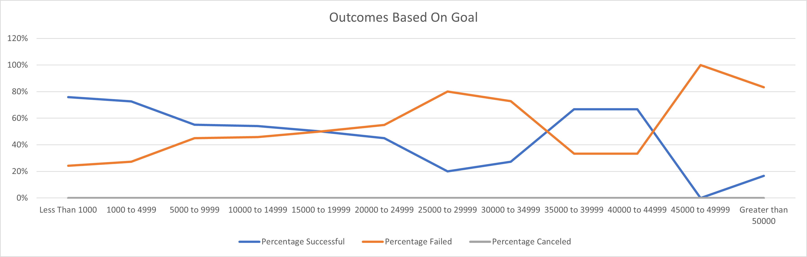

# Kickstarting with Excel

## Overview of Project

### This project examined two different sets of data showing the successfulness of theater related projects on Kickstarter.

## Analysis and Challenges

### The first set of data in this project can help us in deciding what month is best to launch a theater related Kickstarter campaign. The first thing that stands out is that very few Theater realted Kickstarter campaigns are canceled. Also you will see that most theater Kickstarter campaigns succeed, meaning it would be a good category to launch a campaign in. That being said, December is by far the worst month for that campaign launch, with nearly as many failures as successes. Most Theater campaigns are launched in May and that is also the month with the highest number and percentage of successful campaigns. June and July also have high success rates, just not as high as May. The rates for the remaining months are fairly similar to each other and continue to show more successes than failures.
*see Resource: 

### The second set of data also examines Theater related Kickstarter campaigns. This time, however, it is limitied to Plays, ignoring Musicals and Spaces. This data can help us in deciding what goal for the Kickstarter play campaign is most likely to lead to success based on the percentage of successful campaigns for several differant ranges of goals. This data shows us that the less money required to reach the goal, the more chance we would have of the campaign being successful. Once a campaigns goal passes $20K it is more likely to fail then succeed. The chart appears to show an exception to this for campaigns with goals between $35K and $45K however I feel more research would be required to verify that.
*see Resource: 

### Due to the fact that the datasets are different, the data can not tell us when it is best to launch a play camaign, or what goal is best for a General Theater related campaign. There are also other data points that could enhance this information and make it more useful. (If I have misunderstood this question and you are looking for challenges I personally encountered while creating the charts and Pivot tables...) Everything in this unit, aside from the written analysis, is something I do on a daily basis for my job, so it wall pretty straightforward. I imagine if I was new to this however I might have had issues getting the launch date pivot to display Months (depending on the version of excel used). If I had encountered any challanges I feel I would have done the same thing I do when I encounter a challange at work, and that is use google to research a solution.

## Results

- What are two conclusions you can draw about the Outcomes based on Launch Date?: December is the **worst** month to launch a Theater related Kickstarter campaign. May is the **best** month to launch a Theater related Kickstarter campaign.

- What can you conclude about the Outcomes based on Goals?: Campaigns with lower goals are more likely to succeed. A Kickstarter goal for a play campaign should be below $15K

- What are some limitations of this dataset?: The two charts on not based on same set of data so can not be used in conjunction with one another. There are other data points that could be examined in addition what was in the two charts that can help verify the findings. 

- What are some other possible tables and/or graphs that we could create?: It would be interesting to see how the length of a campaign effects it's successfulness also to comapre the goal sizes to the length of the campaign. It might also be helpful to look for trends year over year; For example we know May is the best month to launch a theater campaign for the entire set of data, but it would be interesting to know if for example every year the may numbers have got larger; smaller or stayed the same. Maybe May was best overall, but in the last two years June was actually doing better then May.
